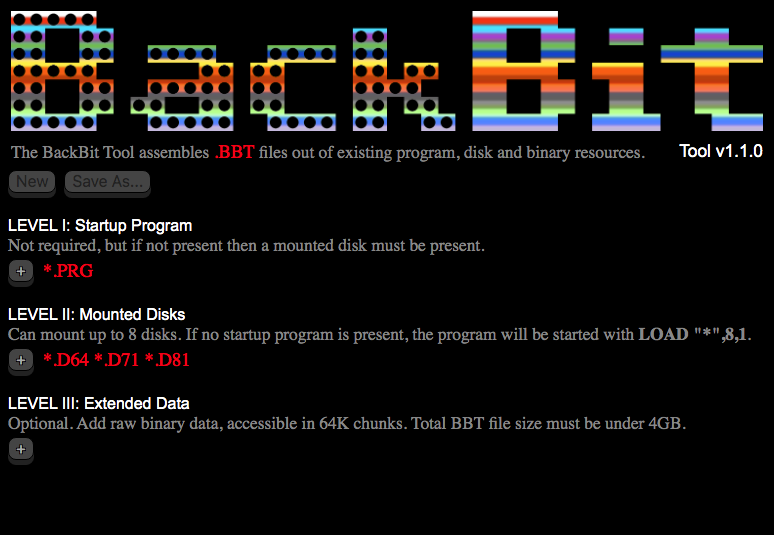

# BackBit-Tool

The BackBit Tool is a fully open source cross-platform JavaScript application that creates .BBT files for use with the BackBit cartridge for Commodore 64.

The BBT file format offers the following innovations:
* Prepend SID music and title screen/screenshots
* Autostarts to any program
* Incorporates up to 8 disk images (D64/D71/D81)
* Supports up to 4 gigabytes of binary data
* Tags important details about the program, including text and screenshots

While this format is designed to integrate with the BackBit cartridge, it is likely that emulators will eventually support this format once there is enough demand.

For the latest compiled build, find it at http://backbit.io/downloads/Tool/.

To discuss working on this tool, go to the forum at http://forum.backbit.io.

The cartridge is available for purchase at http://store.backbit.io.

Comes built with an easy-to-use GUI for Windows (32 & 64-bit), OSX (64-bit), & Linux (32 & 64-bit):



Also usable with a command-line interface:

```
BackBitTool 1.1.0
Usage: BackBitTool <output.bbt> <input files...>
Supported input files include: PRG,D64,D71,D81,SID,KLA
Use any unsupported extension to add extended data
```

This is a NW.js app which means it is a JavaScript application that runs in a browser framework, appearing as an executable on Windows, Mac OSX, or Linux machines. This is great for compatibility, and builds on the Node.js infrastructure.

You must install node & npm:
https://nodejs.org/en/download/

To setup for development (first time only):
* `npm run dev`

To execute in DEBUG mode:
* `npm start`

To compile PRODUCTION builds (outputs to the **build** folder):
* `npm run deploy`

To execute PRODUCTION build (Mac OSX only for now):
* `npm run prod`

To install PRODUCTION build in your Applications folder (Mac OSX only for now):
* `npm run install`

To run COMMAND-LINE version:
* `node src/cmd.js <params>`

TO DO:
* Add support for specifying Koala title screens w/ SID music
* Add support for manuals/instructions
* Add support for screenshots
* Add identifying information, like contributors, publisher, year of release, etc.

TOPICS OF DISCUSSION:
* Storing cracks as patches to preserve originals
* Specifying trainers to preserve settings upon use
* Consistent way of storing high scores
* VICE emulator support
